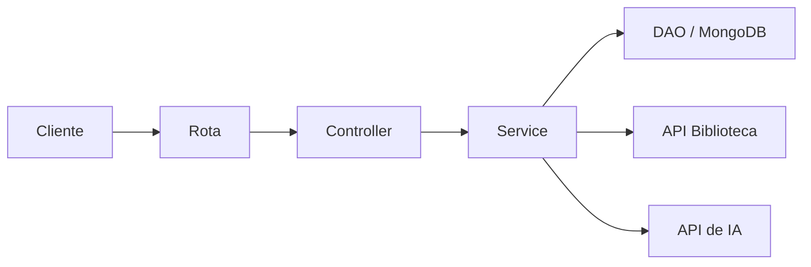

# API IA Biblioteca

Esta é uma API em Python com FastAPI para cadastrar livros, buscar informações em um banco local e, quando necessário, usar uma API externa de biblioteca e uma API de IA para completar os dados.

## Funcionalidades

- Cadastrar, atualizar, consultar e remover livros.
- Buscar livros por ID ou por título.
- Buscar dados na API externa de biblioteca quando o livro não está no banco local.
- Gerar uma descrição automática para o campo "sobre" quando ele estiver vazio.
- Armazenar os dados em MongoDB.

## Como funciona

O projeto é organizado em camadas, cada uma com uma responsabilidade:

- **Rota**: recebe a requisição HTTP.
- **Controller**: recebe a chamada da rota e aciona o service.
- **Service**: contém a regra de negócio (decide de onde buscar os dados).
- **Repository/DAO**: acessa o MongoDB.
- **Clients**: conversam com as APIs externas (biblioteca e IA).

Um exemplo prático de como as camadas trabalham juntas:

1. O cliente pede um livro por ID (`GET /livro/id/{id}`).
2. A rota chama o controller, que chama o service.
3. O service procura primeiro no banco local (MongoDB).
4. Se não encontrar e o ID for numérico, o service busca na API externa de biblioteca e salva o livro localmente.
5. Se o livro não tiver descrição ("sobre"), o service pede pra API de IA gerar uma.
6. O resultado volta formatado até o cliente.



## Tecnologias usadas

- Python
- FastAPI
- Pydantic
- PyMongo
- HTTPX
- python-dotenv
- pytest
- Google GenAI

## Como rodar o projeto

### 1. Clonar o repositório

```bash
git clone <URL_DO_REPOSITORIO>
cd API_IA_biblioteca
```

### 2. Criar e ativar um ambiente virtual

No Windows, PowerShell:

```powershell
python -m venv venv
.\venv\Scripts\Activate.ps1
```

No Linux/macOS:

```bash
python3 -m venv venv
source venv/bin/activate
```

### 3. Instalar as dependências

```bash
pip install -r requirements.txt
```

### 4. Configurar o arquivo .env

Crie um arquivo `.env` na raiz do projeto com as variáveis abaixo:

```env
DATABASE_URL=mongodb://localhost:27017/
DATABASE=Biblioteca
IA_KEY=sua_chave_de_api
MODEL_ID=gemini-2.0-flash
BIBLIOTECA_URL=http://127.0.0.1:8000
BIBLIOTECA_USER=livro
```

### 5. Rodar a aplicação

```bash
uvicorn main:app --reload
```

A API ficará disponível em `http://127.0.0.1:8000`.

## Endpoints da API

| Método | Rota | Descrição |
| --- | --- | --- |
| POST | `/livro/` | Cadastra um novo livro |
| PUT | `/livro/{id}` | Atualiza um livro existente |
| DELETE | `/livro/{id}` | Remove um livro |
| GET | `/livro/id/{id}` | Busca um livro pelo ID |
| GET | `/livro/title/{title}` | Busca livros por título |
| GET | `/livro/` | Lista todos os livros |

## Como rodar os testes

```bash
pytest -q
```

## Estrutura de pastas

```text
api/         # rotas da aplicação
clients/     # integrações com APIs externas
config/      # configuração e variáveis de ambiente
controller/  # controle das operações
models/      # entidades e interfaces
schemas/     # modelos de entrada
service/     # regras de negócio
test/        # testes automatizados
```

Esta aplicação ainda não implementa autenticação na API.
