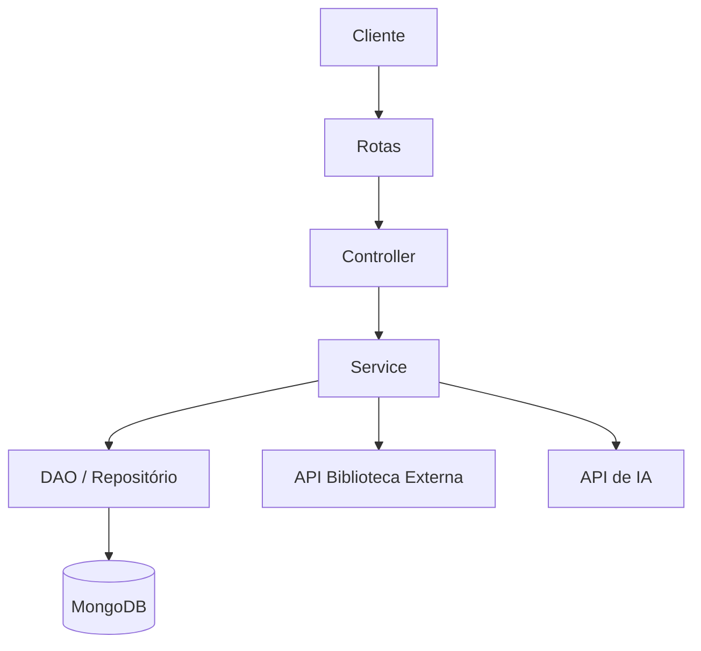
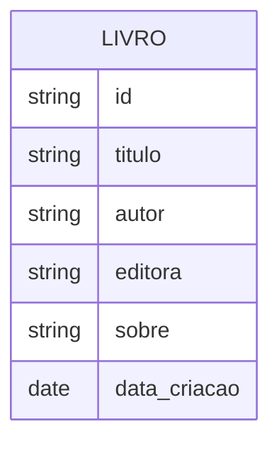

# API IA Biblioteca

## Visão geral

A API IA Biblioteca é uma aplicação backend desenvolvida em Python com FastAPI para gerenciar informações de livros, enriquecer os dados com resumos gerados por inteligência artificial e integrar-se a uma API externa de biblioteca.

O projeto resolve um problema comum em sistemas de catálogo: manter registros de livros com informações básicas e, quando necessário, complementar esses dados com descrições mais ricas e contextuais sem exigir intervenção manual.

### Principais funcionalidades

- Cadastro, atualização, consulta e remoção de livros.
- Busca por título ou identificador.
- Integração com uma API externa de biblioteca para buscar livros quando o registro não existe localmente.
- Geração automática de resumos e descrições por meio de uma API de IA.
- Persistência dos dados em MongoDB.
- Arquitetura organizada em camadas para facilitar manutenção e evolução.

### Público-alvo

Este projeto é voltado para desenvolvedores, estudantes e equipes que desejam aprender ou estender uma aplicação com arquitetura em camadas, integrações externas e uso de IA generativa em um fluxo de negócio real.

---

## Objetivo do projeto

O objetivo principal da aplicação é oferecer um serviço simples e extensível para:

- centralizar o gerenciamento de livros;
- enriquecer o conteúdo com descrições geradas automaticamente;
- reduzir a necessidade de inserção manual de dados;
- integrar múltiplas fontes de informação em um único fluxo.

---

## Arquitetura e funcionamento

A aplicação segue uma abordagem modular, com separação clara entre rotas, controllers, serviços, modelos, repositórios, clientes externos e camada de visualização.

### Fluxo principal

1. O cliente envia uma requisição para a API.
2. A rota direciona a chamada ao controller correspondente.
3. O controller repassa a operação ao service.
4. O service valida a regra de negócio e decide de onde buscar os dados.
5. O repositório consulta o MongoDB, ou a API externa de biblioteca é usada como fallback.
6. Se o campo de descrição estiver ausente, a API de IA gera o conteúdo.
7. O resultado é retornado ao cliente em formato JSON.

### Componentes principais

- Rotas: definem os endpoints HTTP.
- Controller: orquestra a execução da operação.
- Service: implementa as regras de negócio.
- DAO/Repository: acessa e persiste os dados.
- Clients: encapsulam integrações com serviços externos.
- Models/Schemas: representam os dados da aplicação.
- View: formata as respostas para o cliente.

### Arquitetura em alto nível



### Padrões adotados

- Arquitetura em camadas.
- Inversão de dependência por meio de abstrações e container de dependências.
- Separação de responsabilidades entre domínio, infraestrutura e interface.
- Validação de dados com Pydantic.

---

## Tecnologias utilizadas

| Tecnologia | Versão | Finalidade |
| --- | --- | --- |
| Python | 3.10+ | Linguagem principal da aplicação |
| FastAPI | 0.136.3 | Criação da API REST |
| Pydantic | 2.13.4 | Validação e modelagem de dados |
| PyMongo | 4.17.0 | Conexão e acesso ao MongoDB |
| HTTPX | 0.28.1 | Requisições para APIs externas |
| python-dotenv | 1.2.2 | Carregamento de variáveis de ambiente |
| MongoDB | Compatível com PyMongo | Armazenamento dos livros |
| Google GenAI | Via SDK Python | Geração de resumos e descrições por IA |
| pytest | Via ambiente de testes | Execução de testes automatizados |

---

## Pré-requisitos

Antes de iniciar, certifique-se de ter instalado:

- Python 3.10 ou superior.
- MongoDB em execução localmente ou remotamente.
- Acesso a uma chave de API da integração com IA.
- Acesso a uma API externa de biblioteca, caso deseje utilizar o fluxo de fallback.
- Git.
- Um terminal com suporte a PowerShell, Bash ou zsh.

---

## Instalação

### 1. Clonar o repositório

```bash
git clone <URL_DO_REPOSITORIO>
cd API_IA_biblioteca
```

### 2. Criar um ambiente virtual

No Windows, PowerShell:

```powershell
python -m venv venv
.\venv\Scripts\Activate.ps1
```

No Linux/macOS:

```bash
python3 -m venv venv
source venv/bin/activate
```

### 3. Instalar dependências

```bash
pip install -r requirements.txt
```

### 4. Configurar variáveis de ambiente

Crie um arquivo `.env` na raiz do projeto com o conteúdo abaixo:

```env
DATABASE_URL=mongodb://localhost:27017/
DATABASE=Biblioteca
IA_KEY=sua_chave_de_api
MODEL_ID=gemini-2.0-flash
BIBLIOTECA_URL=http://127.0.0.1:8000
BIBLIOTECA_USER=livro
```

> Nunca versionar chaves reais em repositórios públicos. Use o arquivo `.env` localmente e mantenha-o fora do controle de versão.

---

## Configuração

### Banco de dados MongoDB

A aplicação utiliza MongoDB para armazenar os registros de livros. O projeto já contém lógica para criar a coleção `Livros` e índices durante a inicialização, embora a execução dessas operações dependa do estado das flags internas do startup.

### Integração com IA

Para a geração de descrições, a aplicação utiliza uma API de IA. A configuração é feita por meio das variáveis:

- `IA_KEY`
- `MODEL_ID`

### Integração com API de biblioteca

O fluxo de busca pode consultar uma API externa de biblioteca. As variáveis de configuração são:

- `BIBLIOTECA_URL`
- `BIBLIOTECA_USER`

### Ambientes

O projeto é preparado para execução local, mas pode ser adaptado para ambientes de desenvolvimento, homologação e produção com:

- variáveis de ambiente específicas por ambiente;
- configuração de banco de dados separada por contexto;
- uso de secrets e credenciais externas fora do repositório.

---

## Executando o projeto

### Ambiente de desenvolvimento

```bash
uvicorn main:app --reload
```

A aplicação ficará disponível em:

```text
http://127.0.0.1:8000
```

Durante a inicialização, a aplicação:

- conecta ao MongoDB;
- carrega as configurações do `.env`;
- prepara a estrutura da aplicação;
- registra as rotas da API.

### Ambiente de produção

```bash
uvicorn main:app --host 0.0.0.0 --port 8000
```

Em produção, recomenda-se usar um servidor com suporte a processos e monitoramento, como Gunicorn ou Uvicorn com gerenciador de processos.

---

## Estrutura de pastas

```text
API_IA_biblioteca/
├── api/
├── clients/
├── config/
├── controller/
├── database/
├── models/
├── schemas/
├── service/
├── test/
├── view/
├── main.py
├── requirements.txt
└── README.md
```

### Descrição das pastas

- `api/`: rotas e tratamento de exceções de entrada.
- `clients/`: integrações com a API de biblioteca e com a API de IA.
- `config/`: configurações e carregamento do ambiente.
- `controller/`: camada de controle da aplicação.
- `database/`: conexões, migrations e seeds do MongoDB.
- `models/`: entidades e interfaces de acesso aos dados.
- `schemas/`: modelos de entrada e validação com Pydantic.
- `service/`: regras de negócio.
- `test/`: testes automatizados.
- `view/`: formatação das respostas da API.

---

## API

A API expõe endpoints para manipular livros no caminho `/livro`.

### Endpoints

| Método | Endpoint | Descrição |
| --- | --- | --- |
| POST | `/livro/` | Cadastra um novo livro |
| PUT | `/livro/{id}` | Atualiza um livro existente |
| DELETE | `/livro/{id}` | Remove um livro |
| GET | `/livro/id/{id}` | Busca um livro pelo identificador |
| GET | `/livro/title/{title}` | Busca livros por título |
| GET | `/livro/` | Lista todos os livros |

### Exemplo de cadastro

```http
POST /livro/
Content-Type: application/json
```

```json
{
  "titulo": "Dom Casmurro",
  "autor": "Machado de Assis",
  "editora": "Companhia das Letras",
  "sobre": null
}
```

### Exemplo de resposta

```json
{
  "info": "Livro cadastrado com sucesso",
  "id": "..."
}
```

---

## Banco de dados

A aplicação utiliza o MongoDB como banco de dados principal.

### Coleção principal

- `Livros`

### Campos esperados

- `titulo`
- `autor`
- `editora`
- `sobre`
- `data_criacao`

### Estrutura conceitual



### Migrations e seeds

O projeto já conta com mecanismos para criação de coleção, índices e dados iniciais na pasta `database/`.

---

## Fluxo de uso

### Cenário 1: cadastro de um novo livro

1. O cliente envia os dados básicos do livro.
2. A aplicação valida os campos.
3. Se o campo `sobre` estiver vazio, a IA gera uma descrição.
4. O livro é salvo no MongoDB.

### Cenário 2: consulta por título

1. A API tenta localizar o livro no banco local.
2. Se não encontrar, consulta a API externa de biblioteca.
3. Retorna os dados e, se necessário, gera o resumo por IA.

### Cenário 3: atualização de dados

1. O cliente envia o ID do livro e os dados atualizados.
2. O serviço aplica a lógica de negócio.
3. O registro é atualizado e a resposta é retornada.

---

## Testes

Os testes automatizados estão localizados na pasta `test/` e utilizam `pytest`.

### Executar todos os testes

```bash
pytest -q
```

### Cobertura

A suíte cobre cenários de:

- integração com a API de biblioteca;
- integração com a API de IA;
- regras de negócio do service;
- fluxo de persistência e recuperação de dados.

---

## Deploy

Atualmente, o projeto não possui uma configuração pronta de Docker ou CI/CD no repositório. Para deploy em ambientes reais, recomenda-se:

- configurar variáveis de ambiente seguras;
- provisionar uma instância do MongoDB;
- usar um servidor de aplicação compatível com Uvicorn/FastAPI;
- implementar logs e monitoramento;
- habilitar autenticação e controle de acesso se a API for exposta publicamente.

### Exemplo de execução em produção

```bash
uvicorn main:app --host 0.0.0.0 --port 8000
```

---

## Segurança

Embora a aplicação seja funcional, ainda é importante observar as boas práticas de segurança:

- manter chaves e tokens em variáveis de ambiente;
- evitar versionamento de arquivos `.env`;
- validar e sanitizar entradas do usuário;
- proteger endpoints em ambientes públicos com autenticação e autorização;
- usar HTTPS em produção;
- limitar o acesso à API externa de IA e ao banco de dados.

> A implementação atual não expõe autenticação nativa na camada de API; isso pode ser evoluído conforme o uso real do sistema.

---

## Monitoramento e logs

Para manutenção e observabilidade, recomenda-se:

- registrar erros e exceções de forma estruturada;
- coletar logs de requisições e respostas;
- monitorar tempo de resposta e falhas nas integrações externas;
- implementar alertas para indisponibilidade do banco ou da API de IA.

---

## Troubleshooting

| Problema | Causa provável | Solução |
| --- | --- | --- |
| Erro de conexão com o MongoDB | Banco não está disponível ou URL incorreta | Verifique `DATABASE_URL` e se o MongoDB está rodando |
| Falha na busca por título | Serviço externo indisponível ou resposta inesperada | Confirme a API de biblioteca e o endpoint configurado |
| Erro ao gerar resumo com IA | Chave inválida ou quota excedida | Revise `IA_KEY` e o modelo configurado em `MODEL_ID` |
| Endpoint retorna erro 500 | Exceção não tratada no fluxo | Verifique logs e a mensagem da exceção no terminal |

---

## Roadmap

Melhorias previstas para versões futuras:

- adicionar autenticação e autorização;
- implementar testes de integração com banco real;
- incluir containerização com Docker;
- adicionar CI/CD com GitHub Actions;
- melhorar o tratamento de erros e observabilidade;
- incluir documentação OpenAPI mais detalhada;
- suportar mais fontes de dados e mais modelos de IA.

---

## Contribuição

Contribuições são bem-vindas.

### Passos recomendados

1. Faça um fork do projeto.
2. Crie uma branch para sua alteração.
3. Implemente a mudança com testes, quando aplicável.
4. Envie um Pull Request com descrição clara.

### Padrões sugeridos

- manter o código limpo e legível;
- seguir a estrutura já adotada em camadas;
- documentar mudanças relevantes;
- usar mensagens de commit claras e objetivas.

### Convenções de commit

Exemplo:

```bash
git commit -m "feat: adiciona busca por título"
```

---

## Licença

A licença do projeto ainda precisa ser definida. Recomenda-se escolher uma licença aberta, como MIT ou Apache 2.0, e registrar esse dado no repositório.

---

## Contato e suporte

Para dúvidas ou suporte, entre em contato com o responsável pelo projeto ou utilize o canal de issues do repositório.

### Informações necessárias

Para completar esta documentação de forma definitiva, ainda são úteis os seguintes dados:

- URL real do repositório GitHub;
- nome e contato do mantenedor principal;
- licença definitiva do projeto;
- endereço da API externa de biblioteca em ambiente real;
- estratégia de deploy adotada.

---

## Resumo executivo

A API IA Biblioteca é uma aplicação backend em FastAPI que combina catálogo de livros, persistência em MongoDB e enriquecimento por IA para oferecer um fluxo mais inteligente de gestão de conteúdo bibliográfico. Sua estrutura modular facilita a manutenção e a evolução para cenários mais complexos.
